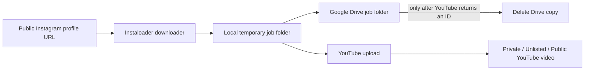

# Instagram → YouTube Transfer

A local web app for transferring **your own public Instagram videos** to your YouTube channel. It downloads the public profile media without an Instagram login, uploads each video to a temporary Google Drive job folder, uploads that same local staging file to YouTube with a caption-derived title and description, and removes the Drive copy only after the YouTube upload succeeds. The local staging file avoids an unnecessary Drive download and is removed afterwards by default.

## What it does



No Instagram login is collected or stored. Consequently, this app cannot process private profiles.

## Before you start

Read [ACCESS.md](ACCESS.md) and complete the Google Cloud OAuth setup. You need a public Instagram profile URL, the Google Drive API, and the YouTube Data API v3.

## Run locally on Windows

```powershell
py -m venv .venv
.\.venv\Scripts\Activate.ps1
pip install -r requirements.txt
Copy-Item .env.example .env
```

Put your downloaded Google OAuth JSON in `client_secret.json`, then start the site:

```powershell
uvicorn app.main:app --host 127.0.0.1 --port 8000 --reload
```

Open [http://127.0.0.1:8000](http://127.0.0.1:8000), select **Connect Google**, then enter a public Instagram profile URL. Start with **Private** YouTube visibility and a small video limit to validate your OAuth setup and metadata.

## Configuration

Copy `.env.example` to `.env`:

| Variable | Purpose |
| --- | --- |
| `APP_BASE_URL` | Site URL. Must match the Google OAuth redirect URI. |
| `SESSION_SECRET` | Random long string protecting OAuth state. |
| `GOOGLE_CLIENT_SECRETS` | OAuth client JSON path. |
| `GOOGLE_TOKEN_FILE` | Local OAuth token path. |
| `APP_PASSWORD` | Optional HTTP Basic password. Set this before exposing the app beyond localhost; sign in as `admin`. |
| `MAX_CONCURRENT_JOBS` | Keep this at `1` to reduce API pressure. |
| `DELETE_LOCAL_AFTER_SUCCESS` | Remove the temporary local file after Drive cleanup succeeds. |

## Production deployment from GitHub

This is a stateful Python application, so **GitHub Pages cannot host it**: Pages serves static files only and cannot run the downloader, OAuth callback, or YouTube upload process. The included `Dockerfile`, `render.yaml`, and GitHub Actions workflow make it ready for a GitHub-connected Render deployment instead.

1. Create an empty GitHub repository and push this project to its `main` branch.
2. In Render, select **New → Blueprint**, connect that GitHub repository, and select `render.yaml`.
3. Set these required secret values in the Render service configuration:
   - `APP_BASE_URL`: the final service URL, for example `https://instagram-youtube-transfer.onrender.com`
   - `APP_PASSWORD`: a strong password (the browser username is `admin`)
   - `GOOGLE_CLIENT_SECRETS_B64`: a Base64-encoded `client_secret.json` value; do not commit the JSON file.
4. In Google Cloud Console, update the OAuth web client's authorized redirect URI to exactly:

   ```text
   https://your-render-domain/api/auth/google/callback
   ```

5. Deploy, open the Render URL, sign in, and select **Connect Google**. Approve access using the Google account that owns the target Drive and YouTube channel.

Render's persistent disk is intentional: it keeps the SQLite job history and encrypted-by-permissions OAuth token across deployments. The app is configured for a single worker because a disk-backed service must remain a single instance.

On Windows PowerShell, generate the required Base64 value without creating another secret file:

```powershell
[Convert]::ToBase64String([IO.File]::ReadAllBytes(".\client_secret.json"))
```

Every push to `main` triggers GitHub Actions image validation, and Render's GitHub integration deploys the updated Blueprint service. Review the host's current plan price before confirming its paid persistent disk.

## Safety and ownership

The confirmation checkbox is deliberate: use this only for video you own or have an explicit right to republish. Anonymous access to Instagram can be rate-limited and may stop working; this app does not try to evade access controls. Review each private YouTube upload for copyright claims, title accuracy, and policy compliance before making it public.

## Project layout

```text
app/main.py          FastAPI routes, website, OAuth callback
app/instagram.py     Public-profile URL validation and downloading
app/google_auth.py   Google OAuth token lifecycle
app/services.py      Drive → YouTube transfer pipeline
app/database.py      SQLite job and video state
app/static/          Browser interface
ACCESS.md            Exact permissions and setup steps
```
